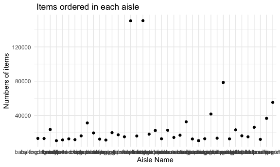
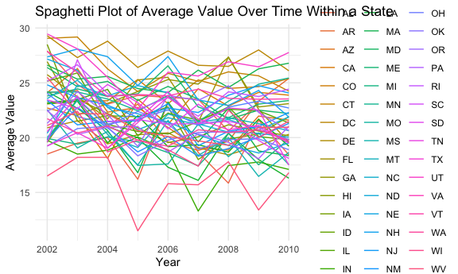
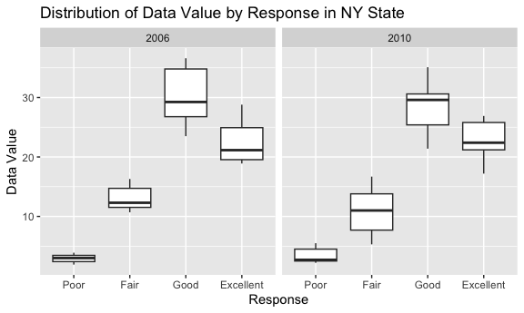
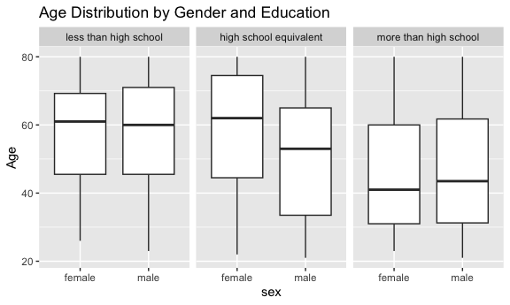
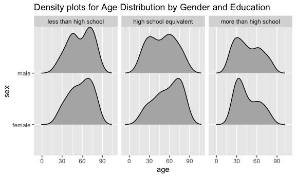
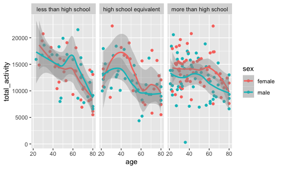
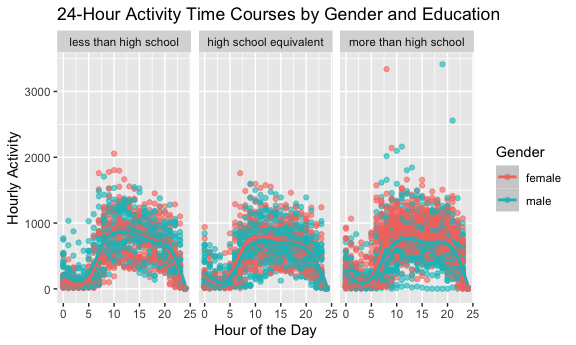

p8105_hw3_ah4167
================
Aiying Huang
2023-10-05

``` r
library(tidyverse)
```

    ## ── Attaching core tidyverse packages ──────────────────────── tidyverse 2.0.0 ──
    ## ✔ dplyr     1.1.3     ✔ readr     2.1.4
    ## ✔ forcats   1.0.0     ✔ stringr   1.5.0
    ## ✔ ggplot2   3.4.3     ✔ tibble    3.2.1
    ## ✔ lubridate 1.9.3     ✔ tidyr     1.3.0
    ## ✔ purrr     1.0.2     
    ## ── Conflicts ────────────────────────────────────────── tidyverse_conflicts() ──
    ## ✖ dplyr::filter() masks stats::filter()
    ## ✖ dplyr::lag()    masks stats::lag()
    ## ℹ Use the conflicted package (<http://conflicted.r-lib.org/>) to force all conflicts to become errors

``` r
library(ggridges)
```

``` r
knitr::opts_chunk$set(
  fig.width = 6,
  fig.asp = .6,
  out.width = "90%"
)
options(dplyr.summarise.inform = FALSE)
```

## Problem 1

``` r
library(p8105.datasets)
data("instacart")
```

``` r
instacart|>
  group_by(aisle)|>
  summarize(n_products=n())
```

    ## # A tibble: 134 × 2
    ##    aisle                  n_products
    ##    <chr>                       <int>
    ##  1 air fresheners candles       1067
    ##  2 asian foods                  7007
    ##  3 baby accessories              306
    ##  4 baby bath body care           328
    ##  5 baby food formula           13198
    ##  6 bakery desserts              1501
    ##  7 baking ingredients          13088
    ##  8 baking supplies decor        1094
    ##  9 beauty                        287
    ## 10 beers coolers                1839
    ## # ℹ 124 more rows

``` r
instacart|>
  group_by(aisle)|>
  summarize(n_products=n())|>
  mutate(
    products_rank=min_rank(desc(n_products)))|>
  filter(products_rank==1)
```

    ## # A tibble: 1 × 3
    ##   aisle            n_products products_rank
    ##   <chr>                 <int>         <int>
    ## 1 fresh vegetables     150609             1

There are 134 aisles , and fresh vegetables are the most items ordered
from.

Make a plot that shows the number of items ordered in each aisle,
limiting this to aisles with more than 10000 items ordered. Arrange
aisles sensibly, and organize your plot so others can read it.

``` r
instacart|>
  group_by(aisle)|>
  summarize(n_products=n())|>
  filter(n_products>10000)|>
  mutate(aisle=fct_reorder(aisle,n_products))|>
  ggplot(aes(x=aisle,y=n_products))+
  geom_bar(stat = "identity")+
  coord_flip()+
  labs(
    title=" Items ordered in each aisle",
    x="Aisle Name",
    y="Numbers of items"
  )+
  theme_minimal()
```



Make a table showing the three most popular items in each of the aisles
“baking ingredients”, “dog food care”, and “packaged vegetables fruits”.
Include the number of times each item is ordered in your table.

``` r
baking_ingredients =
  instacart |>
  filter(
    aisle == "baking ingredients") |>
  group_by(product_name)|>
  summarize(order_count=n())|>
  mutate(
    products_rank=min_rank(desc(order_count)),
    aisle_type="baking ingredients")|>
  filter(products_rank<4)
dog_food_care =
  instacart |>
  filter(
    aisle == "dog food care") |>
  group_by(product_name)|>
  summarize(order_count=n())|>
  mutate(
    products_rank=min_rank(desc(order_count)),
    aisle_type="dog food care")|>
  filter(products_rank<4)
packaged_vegetables_fruits =
  instacart |>
  filter(
    aisle == "packaged vegetables fruits") |>
  group_by(product_name)|>
  summarize(order_count=n())|>
  mutate(
    products_rank=min_rank(desc(order_count)),
    aisle_type="packaged vegetables fruits"
    )|>
  filter(products_rank<4)
```

``` r
  rbind(baking_ingredients, dog_food_care, packaged_vegetables_fruits)|>
  arrange(aisle_type,products_rank)|>
  relocate(aisle_type,products_rank,product_name)|>
  knitr::kable()
```

| aisle_type                 | products_rank | product_name                                  | order_count |
|:---------------------------|--------------:|:----------------------------------------------|------------:|
| baking ingredients         |             1 | Light Brown Sugar                             |         499 |
| baking ingredients         |             2 | Pure Baking Soda                              |         387 |
| baking ingredients         |             3 | Cane Sugar                                    |         336 |
| dog food care              |             1 | Snack Sticks Chicken & Rice Recipe Dog Treats |          30 |
| dog food care              |             2 | Organix Chicken & Brown Rice Recipe           |          28 |
| dog food care              |             3 | Small Dog Biscuits                            |          26 |
| packaged vegetables fruits |             1 | Organic Baby Spinach                          |        9784 |
| packaged vegetables fruits |             2 | Organic Raspberries                           |        5546 |
| packaged vegetables fruits |             3 | Organic Blueberries                           |        4966 |

Make a table showing the mean hour of the day at which Pink Lady Apples
and Coffee Ice Cream are ordered on each day of the week; format this
table for human readers (i.e. produce a 2 x 7 table).

``` r
Pink_Lady_Apples_df=
instacart|>
  group_by(product_name)|>
  filter(product_name=="Pink Lady Apples")|>
  select(order_dow,order_hour_of_day,product_name)|>
  group_by(order_dow)|>
  summarize(
    mean_day_hr=mean(order_hour_of_day)
  )|>
  mutate(
    product_name="Pink Lady Apples"
  )
Coffee_Ice_Cream_df=
  instacart|>
  group_by(product_name)|>
  filter(product_name=="Coffee Ice Cream")|>
  select(order_dow,order_hour_of_day,product_name)|>
  group_by(order_dow)|>
  summarize(
    mean_day_hr=mean(order_hour_of_day)
  )|>
  mutate(
    product_name="Coffee Ice Cream"
  )
```

``` r
rbind(Pink_Lady_Apples_df, Coffee_Ice_Cream_df)|>
  mutate(
    order_dow = case_match(
      order_dow,
      0 ~ "Sunday",
      1 ~ "Monday",
      2 ~ "Tuesday",
      3 ~ "Wednesday",
      4 ~ "Thursday",
      5 ~ "Friday",
      6 ~ "Saturday"
  ))|>
  pivot_wider(
    names_from=order_dow,
    values_from=mean_day_hr
  )|>
  knitr::kable()
```

| product_name     |   Sunday |   Monday |  Tuesday | Wednesday | Thursday |   Friday | Saturday |
|:-----------------|---------:|---------:|---------:|----------:|---------:|---------:|---------:|
| Pink Lady Apples | 13.44118 | 11.36000 | 11.70213 |  14.25000 | 11.55172 | 12.78431 | 11.93750 |
| Coffee Ice Cream | 13.77419 | 14.31579 | 15.38095 |  15.31818 | 15.21739 | 12.26316 | 13.83333 |

## Problem 2

``` r
data("brfss_smart2010")
```

First, do some data cleaning:

``` r
brfss_clean_df=
brfss_smart2010|>
  janitor::clean_names()|>#format the data to use appropriate variable names
  filter(
    topic=="Overall Health",#focus on the “Overall Health” topic
    response %in% c("Excellent", "Very Good", "Good", "Fair", "Poor")#include only responses from “Excellent” to “Poor”
  )|>
  mutate(
    response=factor(
      response,
      levels = c("Poor", "Fair", "Good", "Very Good", "Excellent"), 
      ordered = TRUE
    )#organize responses as a factor taking levels ordered from “Poor” to “Excellent”
  )|>
  separate(locationdesc, into = c("state", "location"),sep=" - ")|>
  select(year,state,location,class,topic,question,response,sample_size,data_value,geo_location)
```

Then we can calculate information below:

In 2002, the states observed at 7 or more locations are CT, FL, MA, NC,
NJ, PA. In 2010, the states observed at 7 or more locations are CA, CO,
FL, MA, MD, NC, NE, NJ, NY, OH, PA, SC, TX, WA.

Furthermore, we construct a dataset that is limited to Excellent
responses, and contains, year, state, and a variable that averages the
data_value across locations within a state. Make a “spaghetti” plot of
this average value over time within a state.

``` r
#Construct a dataset that is limited to Excellent responses, and contains, year, state, and a variable that averages the data_value across locations within a state. 
brfss_clean_df|>
  filter(response=="Excellent")|>
  group_by(state,year)|>
  summarize(avg_data_value=mean(data_value,na.rm=TRUE))|>
#Make a “spaghetti” plot of this average value over time within a state
  ggplot(aes(x = year, y = avg_data_value, color = state, group = state)) +
  geom_line() +
  labs(title = "Spaghetti Plot of Average Value Over Time Within a State",
       x = "Year",
       y = "Average Value",
       color = "State") +
  theme_minimal()
```



``` r
brfss_clean_df|>
  filter(response=="Excellent")|>
  group_by(state,year)|>
  summarize(avg_data_value=mean(data_value,na.rm=TRUE))|>
  filter(state%in%c("IL","IN","KS"))
```

    ## # A tibble: 27 × 3
    ## # Groups:   state [3]
    ##    state  year avg_data_value
    ##    <chr> <int>          <dbl>
    ##  1 IL     2002           23.2
    ##  2 IL     2003           23.5
    ##  3 IL     2004           24.4
    ##  4 IL     2005           20.2
    ##  5 IL     2006           22.2
    ##  6 IL     2007           21.6
    ##  7 IL     2008           22.6
    ##  8 IL     2009           22.4
    ##  9 IL     2010           21.4
    ## 10 IN     2002           19.8
    ## # ℹ 17 more rows

We can see from the plot that West Virginia’s average value over time is
apparently different from those other states since it gets really low
value in 2005 and 2009. Besides, Indiana’s average value is lower than
any other state as well which may reflect some difference between them.
Moreover, most states’ average values follow a pattern that being very
high in 2003,2006 and 2008 but low in the other years.

Make a two-panel plot showing, for the years 2006, and 2010,
distribution of data_value for responses (“Poor” to “Excellent”) among
locations in NY State.

``` r
brfss_clean_df|>
  filter(year%in%c(2006,2010)&state=="NY")|>
  ggplot(aes(x=data_value,y=response))+
  geom_density_ridges(scale = 0.95)+
  facet_wrap(~year)+
  labs(
    title="Distribution of Data Value by Response in NY State",
    x = "Data value",
    y = "Response"
  )
```

    ## Picking joint bandwidth of 1.94

    ## Picking joint bandwidth of 1.77



We can see from the plots above, in New York State, the distribution of
data value for responses among locations is roughly similar, they both
have the high data value for “Good” response and low data value for the
“Poor” response. However, there are still some differences between those
two years if we look into the distribution of each response type. For
example, the distribution of data value for “Good” response in 2006 is
apprantely a bimodal distribution, having two distinct peaks around 27
and 38, while the distribution of data value for “Good” response in 2010
only has one peak around 30. Besides, the peaks of the distribution of
data value for “Excellent” response in both years are around different
values, too. Those all reflect the inner differences of those two year’s
data.

## Problem 3

Load, tidy, merge, and otherwise organize the data sets. Your final
dataset should include all originally observed variables; exclude
participants less than 21 years of age, and those with missing
demographic data; and encode data with reasonable variable classes
(i.e. not numeric, and using factors with the ordering of tables and
plots in mind).

``` r
covar_df=  
  read_csv("./data/nhanes_covar.csv",skip=4,show_col_types = FALSE)|>
  janitor::clean_names()|>
  mutate(
    sex=case_match(sex,
               1~"male",
               2~"female"),
    education=factor(case_match(
      education,
      1~"less than high school",
      2~"high school equivalent",
      3~"more than high school"
    ),
    levels=c("less than high school","high school equivalent","more than high school"),
    ordered = TRUE
    )
  )|>
  filter(
    age>=21
  )|>
  na.omit()
```

``` r
accel_df = 
  read_csv("./data/nhanes_accel.csv")|>
  janitor::clean_names()
```

    ## Rows: 250 Columns: 1441
    ## ── Column specification ────────────────────────────────────────────────────────
    ## Delimiter: ","
    ## dbl (1441): SEQN, min1, min2, min3, min4, min5, min6, min7, min8, min9, min1...
    ## 
    ## ℹ Use `spec()` to retrieve the full column specification for this data.
    ## ℹ Specify the column types or set `show_col_types = FALSE` to quiet this message.

``` r
combine_df=
  inner_join(covar_df, accel_df,by = "seqn")
```

Produce a reader-friendly table for the number of men and women in each
education category, and create a visualization of the age distributions
for men and women in each education category.

``` r
combine_df|>
  group_by(education,sex)|>
  summarize(num_of_people=n())|>
  pivot_wider(
    names_from="education",
    values_from="num_of_people"
  )|>
  knitr::kable(caption="Number of Men and Women in Each Education Category")
```

| sex    | less than high school | high school equivalent | more than high school |
|:-------|----------------------:|-----------------------:|----------------------:|
| female |                    28 |                     23 |                    59 |
| male   |                    27 |                     35 |                    56 |

Number of Men and Women in Each Education Category

From the table above, it is evident that for both female and male
participants, the number of participants with a high level of education
is significantly lower than those with a lower level of education.
However, among male participants, the number of high school graduates is
greater than those who did not graduate from high school, while among
female participants, those without a high school diploma outnumber those
with a high school diploma.

``` r
combine_df|>
  ggplot(aes(x=sex,y=age))+
  geom_boxplot()+
  facet_wrap(~education)+
  labs(
    title="Boxplots for Age Distribution by Gender and Education",
    x = "sex",
    y = "Age"
  )
```



``` r
combine_df|>
  ggplot(aes(x=age,y=sex))+
  geom_density_ridges(scale = 0.9)+
  facet_wrap(~education)+
  labs(
    title="Density plots for Age Distribution by Gender and Education")
```

    ## Picking joint bandwidth of 7.91

    ## Picking joint bandwidth of 9.03

    ## Picking joint bandwidth of 7.15



From the plots above, the age distributions for men and women are
roughly the same if the participants have a “less than high school” or
“more than high school” level of education. However, among participants
with a “high school equivalent” education level, the distribution
between famale ann male is quite different. In the group of participants
who have obtained a high school diploma, females tend to have a higher
average age compared to males, with an average age exceeding 60 years,
whereas males have an average age of just over 50. Besides, participants
with higher educational qualifications have the youngest average age,
around 40 years old, while those with lower educational qualifications
have a significantly higher average age of around 60.

Traditional analyses of accelerometer data focus on the total activity
over the day. Using your tidied dataset, aggregate across minutes to
create a total activity variable for each participant. Plot these total
activities (y-axis) against age (x-axis); your plot should compare men
to women and have separate panels for each education level. Include a
trend line or a smooth to illustrate differences. Comment on your plot.

``` r
combine_df|>
  pivot_longer(
    min1:min1440,
    names_to="time",
    values_to="accelerometer"
  )|>
  group_by(seqn,sex,age,education)|>
  summarise(
    total_activity=sum(accelerometer)
  )|>
  ggplot(
    aes(x=age,y=total_activity,color = sex)
  )+
  geom_point()+
  geom_smooth() + 
  facet_wrap(~education)
```

    ## `geom_smooth()` using method = 'loess' and formula = 'y ~ x'


From the plots above, we can observe that regardless of educational
attainment, activity duration significantly decreases with increasing
age. However, there are distinct patterns within different educational
groups. In the ‘less than high school’ and ‘more than high school’
education categories, we see two peaks in activity duration around the
ages of 20 and 60. In contrast, the ‘high school equivalent’ education
group exhibits a single peak at age 40. Additionally, there are
noticeable gender differences in these distributions. In the ‘less than
high school’ group, females have higher activity duration than males
before the age of 40 but lower duration after. Conversely, in the ‘high
school equivalent’ and ‘more than high school’ groups, females
consistently have higher activity durations than males. Specifically, we
can observe from the chart that within the ‘more than high school’
education group, there are individual females who continue to maintain
high activity levels even beyond the age of 60.

Accelerometer data allows the inspection activity over the course of the
day. Make a three-panel plot that shows the 24-hour activity time
courses for each education level and use color to indicate sex. Describe
in words any patterns or conclusions you can make based on this graph;
including smooth trends may help identify differences.

``` r
combine_df|>
  pivot_longer(
    min1:min1440,
    names_to="time",
    values_to="accelerometer",
    names_prefix="min"
  )|>
  mutate(hour = as.numeric(time) %/% 60) |>
  group_by(seqn, sex, education, hour)|>
  summarise(hourly_activity = sum(accelerometer))|>  
  ggplot(
    aes(x=hour,y=hourly_activity,color = sex)
  )+
  geom_point(alpha=.6)+
  geom_smooth() + 
  facet_wrap(~education)+
  labs(
    title = "24-Hour Activity Time Courses by Gender and Education",
    x = "Hour of the Day",
    y = "Hourly Activity",
    color = "Gender"
  ) 
```

    ## `geom_smooth()` using method = 'gam' and formula = 'y ~ s(x, bs = "cs")'


In summary, it can be observed that the activity time for everyone
generally starts decreasing around midnight, begins to increase around 4
AM, peaks at 10 AM, and continues until around 8 PM before decreasing
again. The activity patterns among different education levels are quite
similar. However, the distinction lies in the difference between the
activity times of men and women. In groups with higher education levels,
females tend to have more activity time compared to males, especially
within the ‘more than high school’ education group, where females
consistently have higher activity times than males.
