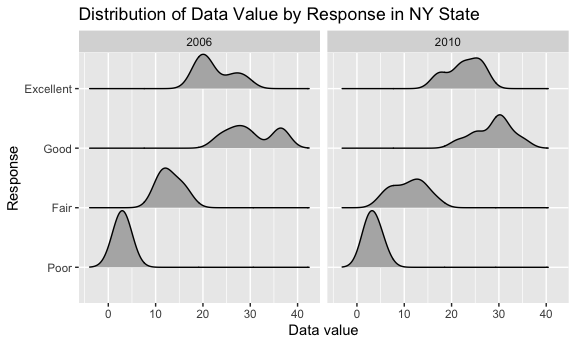

p8105_hw3_ah4167
================
Aiying Huang
2023-10-05

``` r
library(tidyverse)
```

    ## ── Attaching core tidyverse packages ──────────────────────── tidyverse 2.0.0 ──
    ## ✔ dplyr     1.1.3     ✔ readr     2.1.4
    ## ✔ forcats   1.0.0     ✔ stringr   1.5.0
    ## ✔ ggplot2   3.4.3     ✔ tibble    3.2.1
    ## ✔ lubridate 1.9.3     ✔ tidyr     1.3.0
    ## ✔ purrr     1.0.2     
    ## ── Conflicts ────────────────────────────────────────── tidyverse_conflicts() ──
    ## ✖ dplyr::filter() masks stats::filter()
    ## ✖ dplyr::lag()    masks stats::lag()
    ## ℹ Use the conflicted package (<http://conflicted.r-lib.org/>) to force all conflicts to become errors

``` r
knitr::opts_chunk$set(
  fig.width = 6,
  fig.asp = .6,
  out.width = "90%"
)
```

## Problem 1

``` r
library(p8105.datasets)
data("instacart")
```

``` r
instacart|>
  group_by(aisle)|>
  summarize(n_products=n())
```

    ## # A tibble: 134 × 2
    ##    aisle                  n_products
    ##    <chr>                       <int>
    ##  1 air fresheners candles       1067
    ##  2 asian foods                  7007
    ##  3 baby accessories              306
    ##  4 baby bath body care           328
    ##  5 baby food formula           13198
    ##  6 bakery desserts              1501
    ##  7 baking ingredients          13088
    ##  8 baking supplies decor        1094
    ##  9 beauty                        287
    ## 10 beers coolers                1839
    ## # ℹ 124 more rows

``` r
instacart|>
  group_by(aisle)|>
  summarize(n_products=n())|>
  mutate(
    products_rank=min_rank(desc(n_products)))|>
  filter(products_rank==1)
```

    ## # A tibble: 1 × 3
    ##   aisle            n_products products_rank
    ##   <chr>                 <int>         <int>
    ## 1 fresh vegetables     150609             1

There are 134 aisles , and fresh vegetables are the most items ordered
from.

Make a plot that shows the number of items ordered in each aisle,
limiting this to aisles with more than 10000 items ordered. Arrange
aisles sensibly, and organize your plot so others can read it.

``` r
instacart|>
  group_by(aisle)|>
  summarize(n_products=n())|>
  filter(n_products>10000)|>
  ggplot(aes(x=aisle,y=n_products))+
  geom_point()+
  labs(
    title=" Items ordered in each aisle",
    x="Aisle Name",
    y="Numbers of items"
  )+
  theme_minimal()
```


Make a table showing the three most popular items in each of the aisles
“baking ingredients”, “dog food care”, and “packaged vegetables fruits”.
Include the number of times each item is ordered in your table.

``` r
baking_ingredients =
  instacart |>
  filter(
    aisle == "baking ingredients") |>
  group_by(product_name)|>
  summarize(order_count=n())|>
  mutate(
    products_rank=min_rank(desc(order_count)),
    aisle_type="baking ingredients")|>
  filter(products_rank<4)
dog_food_care =
  instacart |>
  filter(
    aisle == "dog food care") |>
  group_by(product_name)|>
  summarize(order_count=n())|>
  mutate(
    products_rank=min_rank(desc(order_count)),
    aisle_type="dog food care")|>
  filter(products_rank<4)
packaged_vegetables_fruits =
  instacart |>
  filter(
    aisle == "packaged vegetables fruits") |>
  group_by(product_name)|>
  summarize(order_count=n())|>
  mutate(
    products_rank=min_rank(desc(order_count)),
    aisle_type="packaged vegetables fruits"
    )|>
  filter(products_rank<4)
```

``` r
  rbind(baking_ingredients, dog_food_care, packaged_vegetables_fruits)|>
  arrange(aisle_type,products_rank)|>
  relocate(aisle_type,products_rank,product_name)|>
  knitr::kable()
```

| aisle_type                 | products_rank | product_name                                  | order_count |
|:---------------------------|--------------:|:----------------------------------------------|------------:|
| baking ingredients         |             1 | Light Brown Sugar                             |         499 |
| baking ingredients         |             2 | Pure Baking Soda                              |         387 |
| baking ingredients         |             3 | Cane Sugar                                    |         336 |
| dog food care              |             1 | Snack Sticks Chicken & Rice Recipe Dog Treats |          30 |
| dog food care              |             2 | Organix Chicken & Brown Rice Recipe           |          28 |
| dog food care              |             3 | Small Dog Biscuits                            |          26 |
| packaged vegetables fruits |             1 | Organic Baby Spinach                          |        9784 |
| packaged vegetables fruits |             2 | Organic Raspberries                           |        5546 |
| packaged vegetables fruits |             3 | Organic Blueberries                           |        4966 |

Make a table showing the mean hour of the day at which Pink Lady Apples
and Coffee Ice Cream are ordered on each day of the week; format this
table for human readers (i.e. produce a 2 x 7 table).

``` r
Pink_Lady_Apples_df=
instacart|>
  group_by(product_name)|>
  filter(product_name=="Pink Lady Apples")|>
  select(order_dow,order_hour_of_day,product_name)|>
  group_by(order_dow)|>
  summarize(
    mean_day_hr=mean(order_hour_of_day)
  )|>
  mutate(
    product_name="Pink Lady Apples"
  )
Coffee_Ice_Cream_df=
  instacart|>
  group_by(product_name)|>
  filter(product_name=="Coffee Ice Cream")|>
  select(order_dow,order_hour_of_day,product_name)|>
  group_by(order_dow)|>
  summarize(
    mean_day_hr=mean(order_hour_of_day)
  )|>
  mutate(
    product_name="Coffee Ice Cream"
  )
```

``` r
rbind(Pink_Lady_Apples_df, Coffee_Ice_Cream_df)|>
  mutate(
    order_dow = case_match(
      order_dow,
      0 ~ "Sunday",
      1 ~ "Monday",
      2 ~ "Tuesday",
      3 ~ "Wednesday",
      4 ~ "Thursday",
      5 ~ "Friday",
      6 ~ "Saturday"
  ))|>
  pivot_wider(
    names_from=order_dow,
    values_from=mean_day_hr
  )|>
  knitr::kable()
```

| product_name     |   Sunday |   Monday |  Tuesday | Wednesday | Thursday |   Friday | Saturday |
|:-----------------|---------:|---------:|---------:|----------:|---------:|---------:|---------:|
| Pink Lady Apples | 13.44118 | 11.36000 | 11.70213 |  14.25000 | 11.55172 | 12.78431 | 11.93750 |
| Coffee Ice Cream | 13.77419 | 14.31579 | 15.38095 |  15.31818 | 15.21739 | 12.26316 | 13.83333 |

## Problem 2

``` r
data("brfss_smart2010")
```

First, do some data cleaning:

``` r
brfss_clean_df=
brfss_smart2010|>
  janitor::clean_names()|>#format the data to use appropriate variable names
  filter(
    topic=="Overall Health",#focus on the “Overall Health” topic
    response %in% c("Excellent", "Very Good", "Good", "Fair", "Poor")#include only responses from “Excellent” to “Poor”
  )|>
  mutate(
    response=factor(
      response,
      levels = c("Poor", "Fair", "Good", "Very Good", "Excellent"), 
      ordered = TRUE
    )#organize responses as a factor taking levels ordered from “Poor” to “Excellent”
  )|>
  separate(locationdesc, into = c("state", "location"),sep=" - ")|>
  select(year,state,location,class,topic,question,response,sample_size,data_value,geo_location)
```

Then we can calculate information below:

In 2002, the states observed at 7 or more locations are CT, FL, MA, NC,
NJ, PA. In 2010, the states observed at 7 or more locations are CA, CO,
FL, MA, MD, NC, NE, NJ, NY, OH, PA, SC, TX, WA.

Furthermore, we construct a dataset that is limited to Excellent
responses, and contains, year, state, and a variable that averages the
data_value across locations within a state. Make a “spaghetti” plot of
this average value over time within a state.

``` r
#Construct a dataset that is limited to Excellent responses, and contains, year, state, and a variable that averages the data_value across locations within a state. 
brfss_clean_df|>
  filter(response=="Excellent")|>
  group_by(state,year)|>
  summarize(avg_data_value=mean(data_value,na.rm=TRUE))|>
#Make a “spaghetti” plot of this average value over time within a state
  ggplot(aes(x = year, y = avg_data_value, color = state, group = state)) +
  geom_line() +
  labs(title = "Spaghetti Plot of Average Value Over Time Within a State",
       x = "Year",
       y = "Average Value",
       color = "State") +
  theme_minimal()
```

    ## `summarise()` has grouped output by 'state'. You can override using the
    ## `.groups` argument.


``` r
brfss_clean_df|>
  filter(response=="Excellent")|>
  group_by(state,year)|>
  summarize(avg_data_value=mean(data_value,na.rm=TRUE))|>
  filter(state%in%c("IL","IN","KS"))
```

    ## `summarise()` has grouped output by 'state'. You can override using the
    ## `.groups` argument.

    ## # A tibble: 27 × 3
    ## # Groups:   state [3]
    ##    state  year avg_data_value
    ##    <chr> <int>          <dbl>
    ##  1 IL     2002           23.2
    ##  2 IL     2003           23.5
    ##  3 IL     2004           24.4
    ##  4 IL     2005           20.2
    ##  5 IL     2006           22.2
    ##  6 IL     2007           21.6
    ##  7 IL     2008           22.6
    ##  8 IL     2009           22.4
    ##  9 IL     2010           21.4
    ## 10 IN     2002           19.8
    ## # ℹ 17 more rows

We can see from the plot that West Virginia’s average value over time is
apparently different from those other states since it gets really low
value in 2005 and 2009. Besides, Indiana’s average value is lower than
any other state as well which may reflect some difference between them.
Moreover, most states’ average values follow a pattern that being very
high in 2003,2006 and 2008 but low in the other years.

Make a two-panel plot showing, for the years 2006, and 2010,
distribution of data_value for responses (“Poor” to “Excellent”) among
locations in NY State.

``` r
brfss_clean_df|>
  filter(year%in%c(2006,2010)&state=="NY")|>
  ggplot(aes(x=response,y=data_value))+
  geom_boxplot()+
  facet_wrap(~year)+
  labs(
    title="Distribution of Data Value by Response in NY State",
    x = "Response",
    y = "Data Value"
  )
```



We can see from the plots that in New York State, the distribution of
data_value for responses among locations is very similar, they both have
the high data value for “Good” response and low data value for the
“Poor” response. However, there are still some differences between those
two years if we look into the distribution of each response type.

## Problem 3
