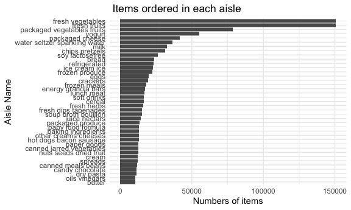

p8105_hw3_ah4167
================
Aiying Huang
2023-10-05

``` r
library(tidyverse)
```

    ## ── Attaching core tidyverse packages ──────────────────────── tidyverse 2.0.0 ──
    ## ✔ dplyr     1.1.3     ✔ readr     2.1.4
    ## ✔ forcats   1.0.0     ✔ stringr   1.5.0
    ## ✔ ggplot2   3.4.3     ✔ tibble    3.2.1
    ## ✔ lubridate 1.9.3     ✔ tidyr     1.3.0
    ## ✔ purrr     1.0.2     
    ## ── Conflicts ────────────────────────────────────────── tidyverse_conflicts() ──
    ## ✖ dplyr::filter() masks stats::filter()
    ## ✖ dplyr::lag()    masks stats::lag()
    ## ℹ Use the conflicted package (<http://conflicted.r-lib.org/>) to force all conflicts to become errors

``` r
knitr::opts_chunk$set(
  fig.width = 6,
  fig.asp = .6,
  out.width = "90%"
)
```

## Problem 1

``` r
library(p8105.datasets)
data("instacart")
```

``` r
instacart|>
  group_by(aisle)|>
  summarize(n_products=n())
```

    ## # A tibble: 134 × 2
    ##    aisle                  n_products
    ##    <chr>                       <int>
    ##  1 air fresheners candles       1067
    ##  2 asian foods                  7007
    ##  3 baby accessories              306
    ##  4 baby bath body care           328
    ##  5 baby food formula           13198
    ##  6 bakery desserts              1501
    ##  7 baking ingredients          13088
    ##  8 baking supplies decor        1094
    ##  9 beauty                        287
    ## 10 beers coolers                1839
    ## # ℹ 124 more rows

``` r
instacart|>
  group_by(aisle)|>
  summarize(n_products=n())|>
  mutate(
    products_rank=min_rank(desc(n_products)))|>
  filter(products_rank==1)
```

    ## # A tibble: 1 × 3
    ##   aisle            n_products products_rank
    ##   <chr>                 <int>         <int>
    ## 1 fresh vegetables     150609             1

There are 134 aisles , and fresh vegetables are the most items ordered
from.

Make a plot that shows the number of items ordered in each aisle,
limiting this to aisles with more than 10000 items ordered. Arrange
aisles sensibly, and organize your plot so others can read it.

``` r
instacart|>
  group_by(aisle)|>
  summarize(n_products=n())|>
  filter(n_products>10000)|>
  ggplot(aes(x=aisle,y=n_products))+
  geom_point()+
  labs(
    title=" Items ordered in each aisle",
    x="Aisle Name",
    y="Numbers of items"
  )
```



Make a table showing the three most popular items in each of the aisles
“baking ingredients”, “dog food care”, and “packaged vegetables fruits”.
Include the number of times each item is ordered in your table.

``` r
baking_ingredients =
  instacart |>
  filter(
    aisle == "baking ingredients") |>
  group_by(product_name)|>
  summarize(order_count=n())|>
  mutate(
    products_rank=min_rank(desc(order_count)),
    aisle_type="baking ingredients")|>
  filter(products_rank<4)
dog_food_care =
  instacart |>
  filter(
    aisle == "dog food care") |>
  group_by(product_name)|>
  summarize(order_count=n())|>
  mutate(
    products_rank=min_rank(desc(order_count)),
    aisle_type="dog food care")|>
  filter(products_rank<4)
packaged_vegetables_fruits =
  instacart |>
  filter(
    aisle == "packaged vegetables fruits") |>
  group_by(product_name)|>
  summarize(order_count=n())|>
  mutate(
    products_rank=min_rank(desc(order_count)),
    aisle_type="packaged vegetables fruits"
    )|>
  filter(products_rank<4)
```

``` r
  rbind(baking_ingredients, dog_food_care, packaged_vegetables_fruits)|>
  arrange(aisle_type,products_rank)|>
  relocate(aisle_type,products_rank,product_name)|>
  knitr::kable()
```

| aisle_type                 | products_rank | product_name                                  | order_count |
|:---------------------------|--------------:|:----------------------------------------------|------------:|
| baking ingredients         |             1 | Light Brown Sugar                             |         499 |
| baking ingredients         |             2 | Pure Baking Soda                              |         387 |
| baking ingredients         |             3 | Cane Sugar                                    |         336 |
| dog food care              |             1 | Snack Sticks Chicken & Rice Recipe Dog Treats |          30 |
| dog food care              |             2 | Organix Chicken & Brown Rice Recipe           |          28 |
| dog food care              |             3 | Small Dog Biscuits                            |          26 |
| packaged vegetables fruits |             1 | Organic Baby Spinach                          |        9784 |
| packaged vegetables fruits |             2 | Organic Raspberries                           |        5546 |
| packaged vegetables fruits |             3 | Organic Blueberries                           |        4966 |

Make a table showing the mean hour of the day at which Pink Lady Apples
and Coffee Ice Cream are ordered on each day of the week; format this
table for human readers (i.e. produce a 2 x 7 table).

``` r
Pink_Lady_Apples_df=
instacart|>
  group_by(product_name)|>
  filter(product_name=="Pink Lady Apples")|>
  select(order_dow,order_hour_of_day,product_name)|>
  group_by(order_dow)|>
  summarize(
    mean_day_hr=mean(order_hour_of_day)
  )|>
  mutate(
    product_name="Pink Lady Apples"
  )
Coffee_Ice_Cream_df=
  instacart|>
  group_by(product_name)|>
  filter(product_name=="Coffee Ice Cream")|>
  select(order_dow,order_hour_of_day,product_name)|>
  group_by(order_dow)|>
  summarize(
    mean_day_hr=mean(order_hour_of_day)
  )|>
  mutate(
    product_name="Coffee Ice Cream"
  )
```

``` r
rbind(Pink_Lady_Apples_df, Coffee_Ice_Cream_df)|>
  mutate(
    order_dow = case_match(
      order_dow,
      0 ~ "Sunday",
      1 ~ "Monday",
      2 ~ "Tuesday",
      3 ~ "Wednesday",
      4 ~ "Thursday",
      5 ~ "Friday",
      6 ~ "Saturday"
  ))|>
  pivot_wider(
    names_from=order_dow,
    values_from=mean_day_hr
  )|>
  knitr::kable()
```

| product_name     |   Sunday |   Monday |  Tuesday | Wednesday | Thursday |   Friday | Saturday |
|:-----------------|---------:|---------:|---------:|----------:|---------:|---------:|---------:|
| Pink Lady Apples | 13.44118 | 11.36000 | 11.70213 |  14.25000 | 11.55172 | 12.78431 | 11.93750 |
| Coffee Ice Cream | 13.77419 | 14.31579 | 15.38095 |  15.31818 | 15.21739 | 12.26316 | 13.83333 |

## Problem 2

``` r
data("brfss_smart2010")
```

First, do some data cleaning:

``` r
brfss_smart2010|>
  janitor::clean_names()|>#format the data to use appropriate variable names
  filter(
    topic=="Overall Health",#focus on the “Overall Health” topic
    response %in% c("Excellent", "Very Good", "Good", "Fair", "Poor")#include only responses from “Excellent” to “Poor”
  )|>
  mutate(
    response=factor(
      response,
      levels = c("Poor", "Fair", "Good", "Very Good", "Excellent"), 
      ordered = TRUE
    )#organize responses as a factor taking levels ordered from “Poor” to “Excellent”
  )
```

    ## # A tibble: 8,500 × 23
    ##     year locationabbr locationdesc     class topic question response sample_size
    ##    <int> <chr>        <chr>            <chr> <chr> <chr>    <ord>          <int>
    ##  1  2010 AL           AL - Jefferson … Heal… Over… How is … Excelle…          94
    ##  2  2010 AL           AL - Jefferson … Heal… Over… How is … Good             208
    ##  3  2010 AL           AL - Jefferson … Heal… Over… How is … Fair             107
    ##  4  2010 AL           AL - Jefferson … Heal… Over… How is … Poor              45
    ##  5  2010 AL           AL - Mobile Cou… Heal… Over… How is … Excelle…          91
    ##  6  2010 AL           AL - Mobile Cou… Heal… Over… How is … Good             224
    ##  7  2010 AL           AL - Mobile Cou… Heal… Over… How is … Fair             120
    ##  8  2010 AL           AL - Mobile Cou… Heal… Over… How is … Poor              66
    ##  9  2010 AL           AL - Tuscaloosa… Heal… Over… How is … Excelle…          58
    ## 10  2010 AL           AL - Tuscaloosa… Heal… Over… How is … Good             171
    ## # ℹ 8,490 more rows
    ## # ℹ 15 more variables: data_value <dbl>, confidence_limit_low <dbl>,
    ## #   confidence_limit_high <dbl>, display_order <int>, data_value_unit <chr>,
    ## #   data_value_type <chr>, data_value_footnote_symbol <chr>,
    ## #   data_value_footnote <chr>, data_source <chr>, class_id <chr>,
    ## #   topic_id <chr>, location_id <chr>, question_id <chr>, respid <chr>,
    ## #   geo_location <chr>
